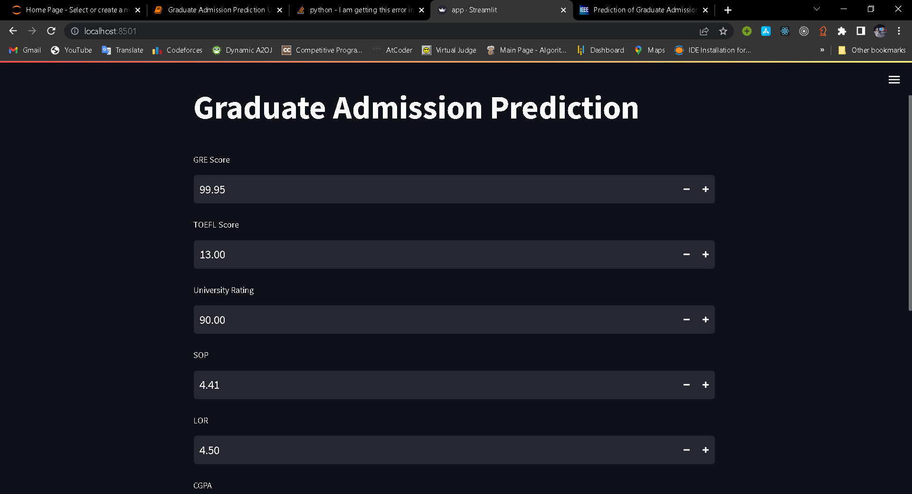
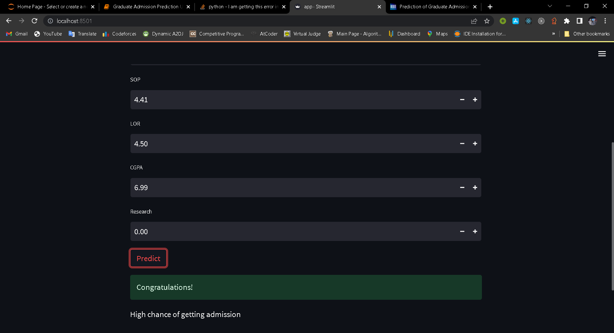

<html>

<body>
<h1>Graduate Admission Prediction</h1>

The use of machine learning can be seen almost everywhere around us, be it Facebook recognizing you or your friends, or YouTube recommending you a video or two based on your history — Machine Learning is everywhere!
However, the ‘magic’ of machine learning is not just limited to only these areas.
Machine Learning is broadly categorized as Supervised and Unsupervised Learning.
Supervised Learning is one in which we teach the machine by providing both independent and dependent variables, for example, Classifying or predicting values.
Unsupervised Learning mainly deals with identifying the structure or pattern of the data. In this type of algorithms, we do not have labeled data(or the dependent variable is absent), for example, clustering data, recommendation systems, etc.
Unsupervised Learning provides amazing results as one can deduce many hidden relations between different attributes or features.
In response to the highly competitive job market at present times, an increased interest in graduate studies has arisen. This has not only burdened applicants but also led to an increased workload on admission faculty members of universities. Any chance of abridging the admission process impelled applicants and faculty workers to look for faster, efficient, and more accurate methods for predicting admissions. 
So,In this project i have solved the problem with supervised machine learning and Gradient Boost Classifier algorithm

<h1>Libraries Used: </h1>
<ul>
<li>Numpy</li>
<li>Pandas</li>
<li>Matplotlib</li>
<li>Seaborn</li>
<li>Sklearn</li>
<li>Pickle</li>
<li>Streamlit</li>
<li></li>
</ul>
<h1><b>WorkFlow</b></h1>

<ol>
<li>Importing Libraries</li>
<li>Displays 5 data from dataset</li>
<li>Check last 5 rows form our dataset</li>
<li>Find shape of our dataset</li>
<li>Get Information About Our Dataset Like Total Number Rows, Total Number of Columns, Datatypes of Each Column And Memory Requirement</li>
<li>Checking Num Values</li>
<li>Get Overall Statistics About Data</li>
<li>Dropping Irrelavent Features </li>
<li>Store Feature Matrix In X and Response(Target) In Vector y</li>
<li>Splitting The Dataset Into The Training Set And Test Set</li>
<li>Feature Scaling</li>
<li>Import The models</li>
<li> Model Training</li>
<li>Prediction on Test Data</li>
<li> Evaluating the Algorithm</li>
<li>Save The Model</li>
<li>Make app for streamlit</li>
</ol>

<video width="320" height="240" controls src="./files/GraduateAdmissionPrediction.mp4">
  <source src="" type="video/mp4">
Video: 
</video>
<a href="https://smsemailspamdetector.herokuapp.com/">Livelink</a>
<a href="https://www.kaggle.com/datasets/mohansacharya/graduate-admissions">Dataset</a>
<h2>Run Project using docker</h2>

<ol>
<li>First install docker</li>
<li>docker pull avijit001/graduateaddmission</li>
<li>docker run -p 8501:8501 avijit001/graduateaddmission:latest</li>
</ol>
</body>

</html>
